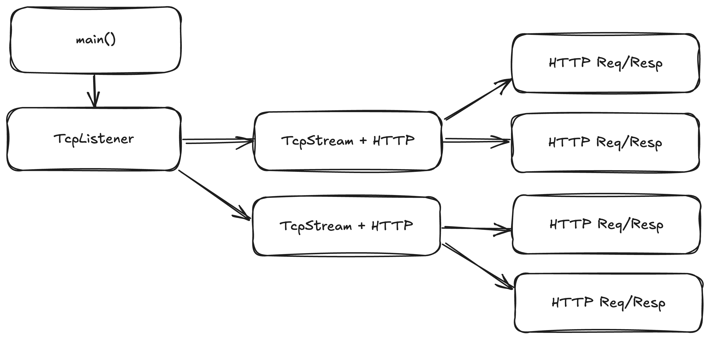

# Chapter 2 - Actors between the lines

As I said in the last chapter, you can think of most tokio tasks as being an actor.
I'm not super opinionated on "communitcate via shared-memory" or "share memory via communication" camp.
I say share memory if it makes your program more efficient. However, if you think about it,
all tasks own some state, which is mutated when it receives some order of external influences.

A common manifestation of this are web frameworks like the modern day `actix-web` and `axum`. To prove my earlier point, `actix-web`,
despite the name, is no longer based on the `actix` actor framework, and is now built solely on top of tokio tasks.
When you use these web frameworks, what happens underneath is that:

1. A tokio task is waiting on `TcpListener::accept`
2. When a socket connects, it is spawned into a new tokio task
3. The new tokio task waits to read data from that TcpStream until a HTTP Request is available
4. The handler for the HTTP request is spawned into a new tokio task

So let's look at the heirachy here:
* We have a task that owns a TcpListener.
  * Which spawns many tasks that each own a TcpStream
    * Which spawns many tasks that each own a HTTP Request

