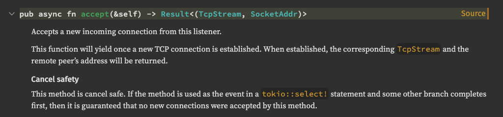

## Cancellation safety

I put "cancelled" in scare-quotes here, as it's quite a subtle problem.



Take a look at this example

```rust
let mut interval = interval(Duration::from_secs(1));
loop {
    select! {
        _ = foo() => println!("foo done"),
        _ = interval.tick() => println!("tick"),
    }
}
```

When the interval timer ticks forward, it
1. stops processing the `foo()` function.
2. print's "tick".
3. the loop resumes and starts a **new** `foo()` function.

Unless special care was put into making this `foo()` function, there's no guarantee that it will pick
up where it left off.

This at best is just a performance loss as you re-play all steps needed to get back to the same place.
At worst this will cause values to be lost forever, eg if `foo()` had read a message from a channel
but hadn't yet processed it.

```rust
async fn foo() {
    let value = some_channel.recv().await;

    // stopped here
    // value is lost forever

    process(value).await;
}
```

### Workaround

There is a workaround, but unfortunately it is rather ugly. You must pin the future upfront, which allows
you to re-use and resume the same async function.

```rust
let mut interval = interval(Duration::from_secs(1));

// store the foo state outside of the loop
let mut foo_fn = pin!(foo());

loop {
    select! {
        // as_mut allows us to re-use the same foo state
        _ = foo_fn.as_mut() => {
            println!("foo done");

            // restart foo_fn
            foo_fn.set(foo());
        }
        _ = interval.tick() => println!("tick"),
    }
}
```
