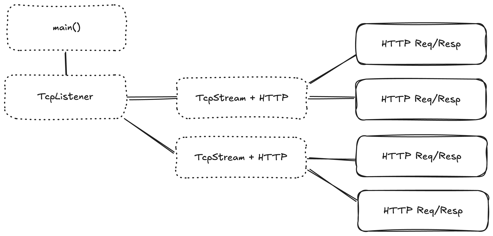

# Chapter 3 - Cancellation

<!-- select, timeout, CancellationToken, cancellation safety -->

Getting an application running is relatively easy, as we have just seen.

Telling the application to stop running is also easy, via the interrupt/terminate signal offered
by your operating system.

However, telling the application to stop running _gracefully_ requires some effort.

## What is Graceful Shutdown



We need to put our application into a limbo state, where it still waits for lower tasks to complete, but it will not create any new
tasks. In the context of HTTP, that could be distilled into

1. Stop accepting new TCP connections
2. Tell all existing TCP connections to stop accepting new HTTP requests
3. Wait for all HTTP requests to complete
4. Wait for all TCP connections to close

## Handling ctrl C in tokio

Tokio makes it easy to capture a ctrl-C even (commonly used for shutdown signalling)

```rust
tokio::signal::ctrl_c().await.expect("could not register signal handler")
```

## select!

Unfortunately, awaiting for a ctrl-C like we do above will not be super useful. We still need a way to
do something about it.

This is where we will introduce `select!`, the ability to run two or more tasks, see which one finishes first,
and then stop the remaining tasks. It's available in many differnt forms

- [`tokio::select!`](https://docs.rs/tokio/latest/tokio/macro.select.html)
- [`futures::future::select`](https://docs.rs/futures/latest/futures/future/fn.select.html)
- [`futures_concurrency::Race`](https://docs.rs/futures-concurrency/latest/futures_concurrency/future/trait.Race.html#tymethod.race)

Which mode you use doesn't really matter, the outcome is practically the same.

```rust
loop {
    select! {
        _ = ctrl_c() => break,
        res = listener.accept() => {
            let (stream, _addr) = res?;
            tokio::spawn(conn_handler(stream));
        }
    }
}
```

- If `ctrl_c()` completes first, `listener.accept()` is "cancelled", and the loop breaks.
- If `listener.accept()` completes first, then `ctrl_c()` is "cancelled", and the handler is spawned and the loop repeats

## Cancellation Tokens

In our applications, we will have to initate shutdowns in many places. Putting a ctrl_c handler everywhere can get
quite unweildy in practice, and it is also hard to test. To combat that, the tokio developers have provided
a feature called a [`CancellationToken`](https://docs.rs/tokio-util/latest/tokio_util/sync/struct.CancellationToken.html)
in their `tokio-util` crate.

Cancellation tokens can be cloned and passed around to all levels of your application. As soon as one of the tokens
is cancelled, all the other tokens will detect this. They also have the ability to branch as children.
Cancelling a parent will cancel all children, but cancelling a child will only cancel that child.

Using a cancellation token together with ctrl_c is pretty straightforward:

```rust
let token = CancellationToken::new();

tokio::spawn({
    let token = token.clone();
    async move {
        // cancels the token when the guard is dropped
        let _guard = token.drop_guard();

        // wait until ctrl_c is received
        _ = ctrl_c().await.unwrap();

        // drop the token guard...
    }
});

// use the token
loop {
    select! {
        _ = token.cancelled() => break,
        res = listener.accept() => {
            let (stream, _addr) = res?;
            // it might be sensible to also forward
            // a child cancellation token to the connection
            tokio::spawn(conn_handler(stream, token.child()));
        }
    }
}
```

There's a slightly cleaner implemntation of the accept loop we can use now, thanks to a helper method by `CancellationToken`.

```rust
while let Some(res) = token.run_until_cancelled(listener.accept()).await {
    let (stream, _addr) = res?;
    tokio::spawn(conn_handler(stream, token.child()));
}
```

## Waiting for completion

So far, we haven't actually achieved our goals of shutting down gracefully. We've only changed how shutdowns are triggered.

To wait for shutdowns, we can use another feature from `tokio_util`, [`TaskTracker`](https://docs.rs/tokio-util/latest/tokio_util/task/task_tracker/struct.TaskTracker.html).

If you're familiar with Go, this is similar to a WaitGroup.

We will replace each `tokio::spawn` with a `task_tracker.spawn`. `TaskTracker` then offers a `.wait().await` method
to wait until all tasks finish.

```rust
let tracker = TaskTracker::new();

while let Some(res) = token.run_until_cancelled(listener.accept()).await {
    let (stream, _addr) = res?;
    // spawn and track the task
    tracker.spawn(conn_handler(stream, token.child()));
}

// no more tasks will be spawned.
tracker.close();

// wait for all tracked tasks to complete
tracker.wait().await
```
