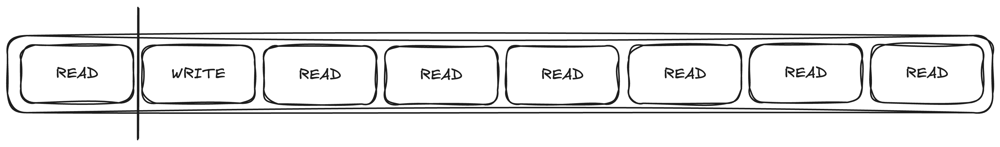

# Locking

All the way at the beginning of this workshop, I brought up that I'm not a purist on "share memory to communicate" or
"communicate to share memory". I would prefer to use whatever the right abstraction is for the task at hand.
A well beaten drum is that channels are usually implemented via shared ring-buffers. The underlying implemntation is
not important, but the abstraction you present is.

So why am I about to tell you that async Mutex/RwLock's are evil and should never be used?


This seems to be a topic many people struggle with. So I think it's worth having a discussion about.
A big topic in async, which I haven't properly mention yet, is blocking. Blocking is something
that caused great trouble in async code as when a function "blocks", it stops the runtime
from being able to use this thread for any other task. This is especially bad when this blocking
is mostly just waiting (IO or waiting for a mutex), as the thread is doing literally nothing,
while the runtime might have tasks it wants to schedule. So, if a mutex lock might have to
wait, why would we not want an async version instead?

I believe this stems from a set of misunderstandings about mutexes in general.

### How fast is a mutex

Mutexes are fast. Very fast. You can lock a mutex in 20ns, assuming it's not currently locked and no other threads
are also trying to lock it. In my humble experience, that's extremely common.

Let's say you hold a lock for 50us (which is quite a lot of time in Rust - you can do a lot in 50us), and
you have 10000 requests per second, each request only touches the lock once. If we expect the tasks to be
evenly distributed over time, then the lock is expected to have only 1 task with access, and unlocked the other 50% of the time.

Since occasional spikes will happen, it's possible some tasks will need to queue up. Potentially the extra contention of the lock
will cause the throughput to fall which causes more tasks to backup etc. Fortunately, since tokio only uses a few threads,
the content ends up staying low. In my experience, switching to an async mutex does not reduce contention as the tokio mutex
internally uses a blocking mutex! If these spikes reducing your throughput are a concern,
my advice would be to reduce the average 50us lock duration,
or try and shard your dataset to reduce the chance of a lock collision.

### Mutex protects data

This might be a concept that only really applies to Rust. A mutex in some other language might be how you introduce
any critical section, but in async Rust we have some other tools that are much likely better. I would strongly
argue that a mutex is to protect _data_, whereas a semaphore should be used to introduce a _critical section_.

What do I mean by this? A critical section is a span of time where you want only a few things (possible one thing)
to occur at a time. You should reason to yourself why you want a critical section, as they introduce a direct bottleneck
to your throughput, but they are absolutely valid.

A mutex protects data and data only. It does this via a critical section, but it _should not be used for_ a critical section.

### Emulating an async mutex

You can easily emulate an async mutex via a semaphore and a blocking mutex. You can use the semaphore with permit count of 1
to define your long critical, and then for any data you need to modify, use the regular blocking mutex. It will be uncontended.

```rust
// only 1 permit
let semaphore = Semaphore::new(1);
let data = Mutex::new(1);

let _permit = semaphore.acquire(1).await;
*data.lock().unwrap() = 2;
```

In fact, tokio's Mutex basically does this, although using an `UnsafeCell` rather than a mutex.

```rust
pub struct Mutex<T: ?Sized> {
    #[cfg(all(tokio_unstable, feature = "tracing"))]
    resource_span: tracing::Span,
    s: semaphore::Semaphore,
    c: UnsafeCell<T>,
}
```

### Fair RwLocks

`RwLock`s are especially problematic. They often give a false sense of security. What's wrong with the following sentence?

> Many tasks hold a read lock during the entire request, and occasionally one task very briefly holds a write lock

The problem is fairness.



When a write lock is queued, it forces all future read locks to also be queued.
The write lock will queue until the final previous read lock is still acquired.

This is clearly not the intention with the quote above, so it's a bug waiting to happen. Assuming that the intent
is to have a cached configuration value, perhaps a watch channel might be a better fit. If you don't need to track updates, using the `arc-swap` crate might be a viable alternative.

## Semaphores

I've spoken a bit about why we should use semaphores instead of mutex where possible.
What's nice about semaphores is that they scale to multiple permits.

Setting limits in your application throughput is always sensible. **Your application has limits**,
you just haven't documented them. Eventually you will have too much bandwidth, CPU, memory, or upstream
API rate limits. It is good to measure it and make it official with a semaphore. If you do this,
if you hit your limits, you will at least be able to reason about it and have the appropariate logging.

Speaking of limits, tokio's channel implementations use semaphores internally for this reason.
You have probably seen that there's bounded and unbounded channels. Bounded channels can only buffer
a fixed number of messages, which is good to prevent accepting messages if you know it will be stuck
in a queue for ages, and taking up space in memory. Internally, they uses a semaphore where each message holds a permit.
